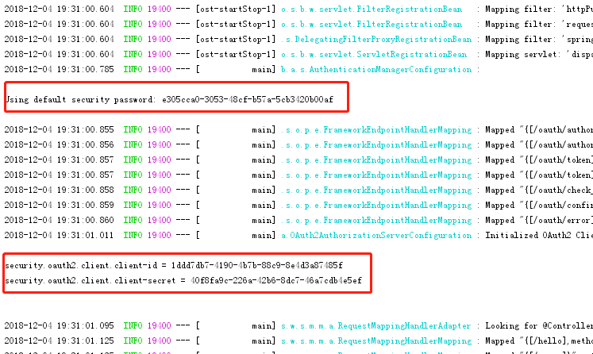
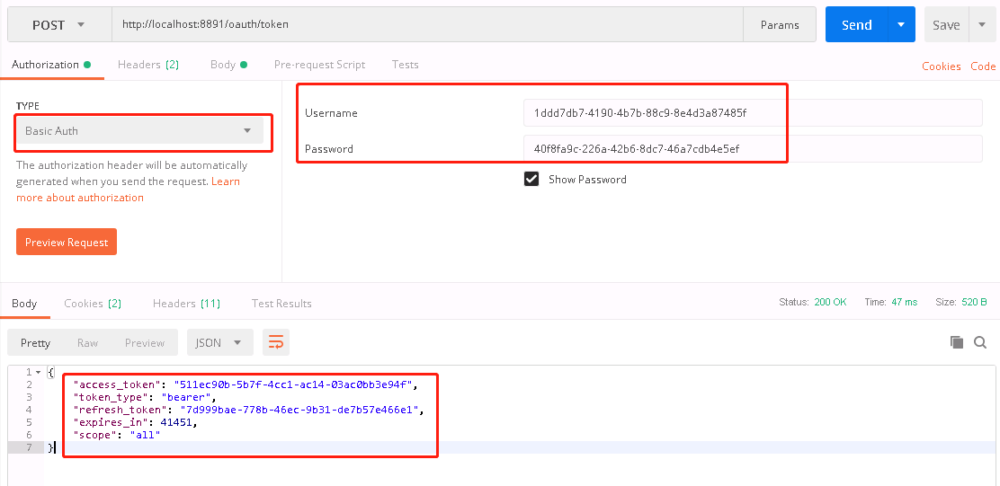
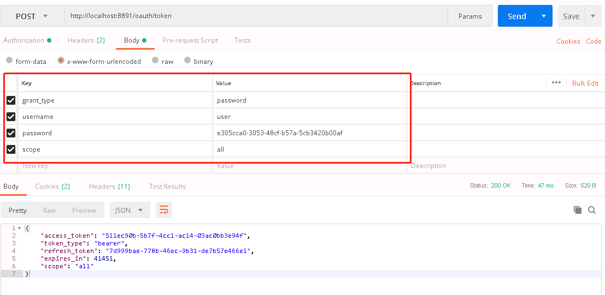
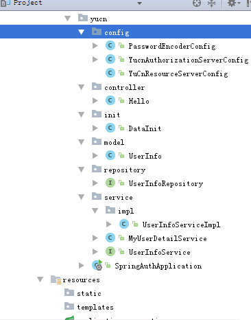

# Spring Security Oauth2 最基本的实现
## 后端
- 加入依赖包
```
<dependency>
  <groupId>org.springframework.security.oauth</groupId>
  <artifactId>spring-security-oauth2</artifactId>
</dependency>
```
- 启动认证服务器
```
@Configuration
@EnableAuthorizationServer
public class YucnAuthorizationServerConfig{
}
```
注意：先实现最原始的功能，所有设置全部采用默认，不要在继承AuthorizationServerConfigurerAdapter，一旦继承，就需要在类中进行相应配置
- 启动资源服务器
```
@Configuration
@EnableResourceServer
public class YuCnResourceServerConfig{
}
```
- 运行程序



- postman测试





## 前端Vue
```
methods: {
  hello(){
    getRequest(`api/hello`,{
      headers: {'Authorization': 'bearer ' + this.access_token}
    })
      .then(response=>{
        console.log(response.data);
      })
  },
  login() {
    postRequest(`api/oauth/token`, qs.stringify({
      grant_type: 'password',
      username: 'user',
      password: 'e305cca0-3053-48cf-b57a-5cb3420b00af',
      scope: 'all'
    }), {
      headers: {'content-type': 'application/x-www-form-urlencoded'},
      auth: {
        username: '1ddd7db7-4190-4b7b-88c9-8e4d3a87485f',
        password: '40f8fa9c-226a-42b6-8dc7-46a7cdb4e5ef'
      }
    })
      .then(response => {
        // localStorage.setItem('token',response.data.access_token);
        this.access_token=response.data.access_token;
        console.log(this.access_token);
      });
  }
},
```
# Lesson 1实现数据库读取用户
## 后端
- 文件结构



- 认证服务器
```
@Configuration
@EnableAuthorizationServer
public class YucnAuthorizationServerConfig extends AuthorizationServerConfigurerAdapter {
    @Autowired
    private AuthenticationManager authenticationManager;
    @Autowired
    private UserDetailsService userDetailsService;
    @Autowired
    private TokenStore tokenStore;

    @Override
    public void configure(ClientDetailsServiceConfigurer clients) throws Exception {
        clients.inMemory()
                .withClient("test")
                .authorizedGrantTypes("password", "refresh_token")
                .scopes("all")
                .secret("123456")
                .accessTokenValiditySeconds(10000)
                .refreshTokenValiditySeconds(10000);
    }

    @Override
    public void configure(AuthorizationServerEndpointsConfigurer endpoints) throws Exception {
        endpoints.tokenStore(tokenStore)
                .authenticationManager(authenticationManager)
                .userDetailsService(userDetailsService);
    }

    @Bean
    public TokenStore tokenStore() {
        return new InMemoryTokenStore();
    }
}
```
## 前端
- 登录和读取数据代码
```
export default {
    name: "Login",
    data() {
      return {
        username: '',
        password: '',
        access_token: ''
      }
    },
    computed: {},
    created() {
    },
    methods: {
      hello() {
        getRequest(`api/hello`, {
          headers: {'Authorization': 'bearer ' + this.access_token}
        })
          .then(response => {
            console.log(response.data);
          })
      },
      login() {
        postRequest(`api/oauth/token`, qs.stringify({
          grant_type: 'password',
          username: this.username,
          password: this.password,
          scope: 'all'
        }), {
          headers: {'content-type': 'application/x-www-form-urlencoded'},
          auth: {
            username: 'test',
            password: '123456'
          }
        })
          .then(response => {
            // localStorage.setItem('token',response.data.access_token);
            this.access_token = response.data.access_token;
            console.log(this.access_token);
          });
      }
    },
    components: {}
  }
</script>
```


