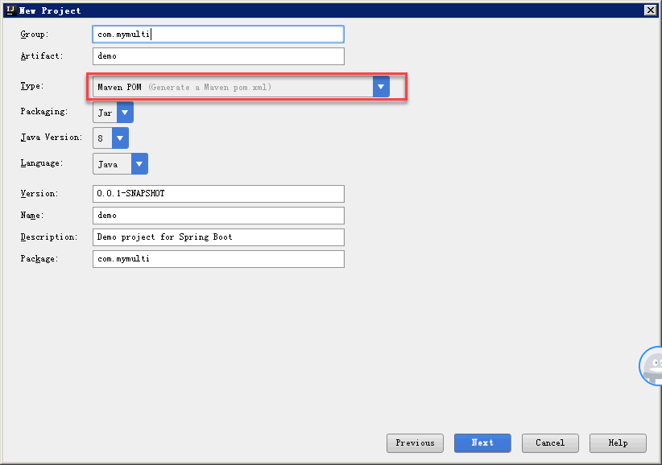
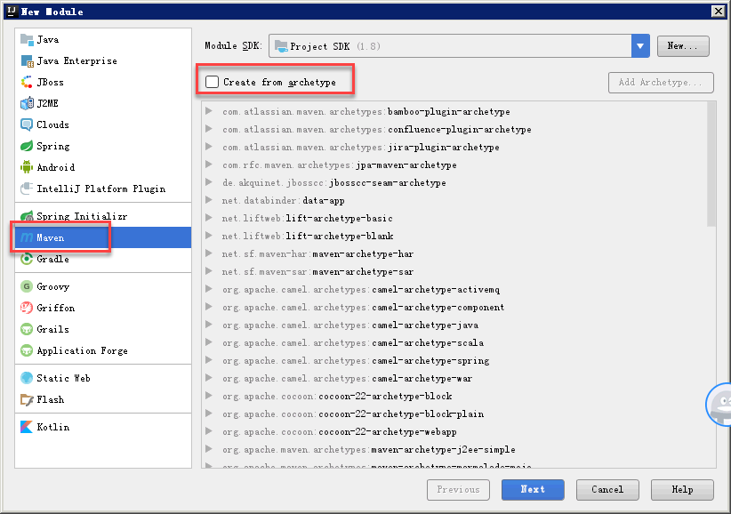
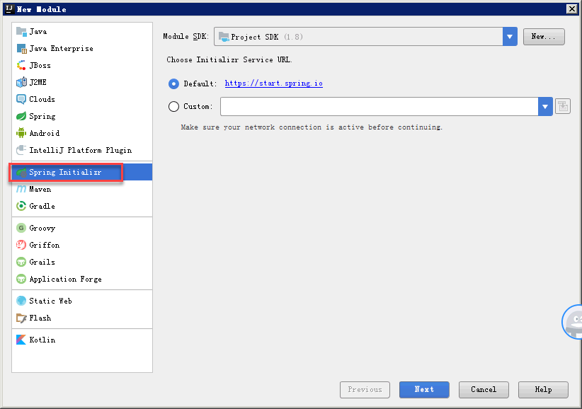

# 创建springboot多模块应用
- 新建project

- 创建普通子模块

- 创建应用子模块

- 修改应用子模块pom
```xml
<?xml version="1.0" encoding="UTF-8"?>
<project xmlns="http://maven.apache.org/POM/4.0.0" xmlns:xsi="http://www.w3.org/2001/XMLSchema-instance"
	xsi:schemaLocation="http://maven.apache.org/POM/4.0.0 http://maven.apache.org/xsd/maven-4.0.0.xsd">
	<modelVersion>4.0.0</modelVersion>
	<parent>
		<groupId>com.yucn</groupId>
		<artifactId>mymulti</artifactId>
		<version>0.0.1-SNAPSHOT</version>
		<relativePath/> <!-- lookup parent from repository -->
	</parent>
	<groupId>com.yucn</groupId>
	<artifactId>demo</artifactId>
	<version>0.0.1-SNAPSHOT</version>
	<name>demo</name>
	<description>Demo project for Spring Boot</description>

	<properties>
		<java.version>1.8</java.version>
	</properties>

	<dependencies>
		<dependency>
			<groupId>com.yucn</groupId>
			<artifactId>auth</artifactId>
			<version>0.0.1-SNAPSHOT</version>
		</dependency>

		<dependency>
			<groupId>org.springframework.boot</groupId>
			<artifactId>spring-boot-starter-test</artifactId>
			<scope>test</scope>
		</dependency>
	</dependencies>

	<build>
		<plugins>
			<plugin>
				<groupId>org.springframework.boot</groupId>
				<artifactId>spring-boot-maven-plugin</artifactId>
			</plugin>
		</plugins>
	</build>

</project>

```
- 修改工程pom，通过maven创建的子模块会自动引入到工程pom的module标签中，应用子模块由于通过spring initializer创建的，不会自动引入，需要手动添加
```xml
<?xml version="1.0" encoding="UTF-8"?>
<project xmlns="http://maven.apache.org/POM/4.0.0" xmlns:xsi="http://www.w3.org/2001/XMLSchema-instance"
	xsi:schemaLocation="http://maven.apache.org/POM/4.0.0 http://maven.apache.org/xsd/maven-4.0.0.xsd">
	<modelVersion>4.0.0</modelVersion>
	<packaging>pom</packaging>
	<modules>
		<module>auth</module>
		<module>demo</module>
	</modules>
	<parent>
		<groupId>org.springframework.boot</groupId>
		<artifactId>spring-boot-starter-parent</artifactId>
		<version>2.1.1.RELEASE</version>
		<relativePath/> <!-- lookup parent from repository -->
	</parent>
	<groupId>com.yucn</groupId>
	<artifactId>mymulti</artifactId>
	<version>0.0.1-SNAPSHOT</version>
	<name>mymulti</name>
	<description>Demo project for Spring Boot</description>

	<properties>
		<java.version>1.8</java.version>
	</properties>

	<dependencies>
		<dependency>
			<groupId>org.springframework.boot</groupId>
			<artifactId>spring-boot-starter-data-jpa</artifactId>
		</dependency>

		<dependency>
			<groupId>org.springframework.boot</groupId>
			<artifactId>spring-boot-starter-web</artifactId>
		</dependency>

		<dependency>
			<groupId>com.h2database</groupId>
			<artifactId>h2</artifactId>
			<scope>runtime</scope>
		</dependency>
		<dependency>
			<groupId>org.projectlombok</groupId>
			<artifactId>lombok</artifactId>
			<optional>true</optional>
		</dependency>
		<dependency>
			<groupId>org.springframework.boot</groupId>
			<artifactId>spring-boot-starter-test</artifactId>
			<scope>test</scope>
		</dependency>

	</dependencies>

	<build>
		<plugins>
			<plugin>
				<groupId>org.springframework.boot</groupId>
				<artifactId>spring-boot-maven-plugin</artifactId>
			</plugin>
		</plugins>
	</build>

</project>

```
- 应用子模块添加其他模块的依赖，参考以上的代码
- 解决普通子模块测试无法注入的问题
    - 在相应模块的测试包中增加SpringBootApplication，便于加载上下文，SpringBoot默认自动扫描该类以下的包
```java
package com.yucn;

import org.springframework.boot.autoconfigure.SpringBootApplication;

/**
 * Created by Administrator on 2018/12/15.
 */
@SpringBootApplication
public class AuthApplication {
}

```
